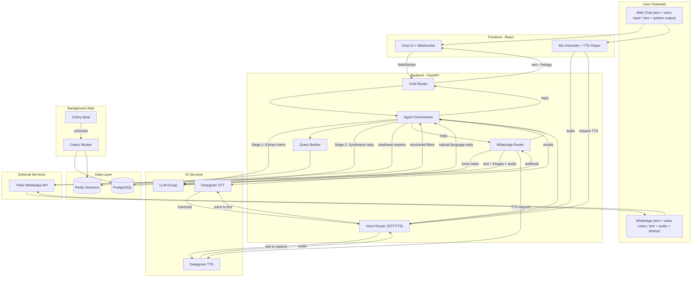
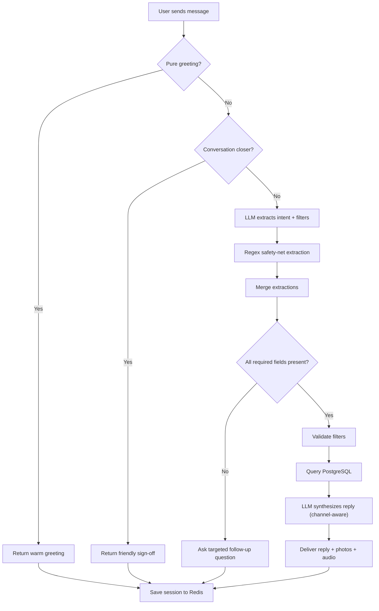

# Real Estate AI Agent — Executive Summary Document

**Prepared for:** CTO Review and Client Pitch
**Project:** REALESTATE_AGENT — Multi-Channel Conversational AI Platform

---

## 1. Objective

Build an **intelligent, multi-channel conversational assistant** that enables end-users to discover, compare, and shortlist real estate properties through natural language — via **web chat**, **voice**, and **WhatsApp** — without navigating traditional search filters, forms, or listings pages.

The system replaces the conventional "filter-and-browse" experience with a single conversational interface that:

- **Understands intent** from natural language (e.g. "I want a 2-bedroom apartment to rent in Austin under $2,500")
- **Asks targeted follow-up questions** when information is incomplete
- **Searches a structured database** using validated, parameterised queries
- **Presents results with context** — text summaries, property photos, and pricing — tailored to the channel (rich cards on web, image messages on WhatsApp, spoken summaries on voice)
- **Maintains session memory** across turns so users can refine searches naturally

The primary business goal is to **increase lead conversion** by reducing friction between property discovery and agent engagement, while extending reach to WhatsApp (the dominant messaging channel in many markets).

---

## 2. Feature Set

### 2.1 Conversational AI Engine
- Two-stage LLM pipeline: **intent extraction** then **response synthesis**
- Deterministic guardrails for greetings, closers, and edge cases
- Regex safety net for LLM extraction failures
- Channel-aware prompting (web vs voice vs WhatsApp tone/format)
- Session memory via Redis with configurable TTL

### 2.2 Web Chat
- Real-time WebSocket-based conversation
- Inline property cards with photos, pricing, and key features
- "New Chat" session reset
- Responsive, modern UI

### 2.3 Voice (Speech-to-Text + Text-to-Speech)
- Browser microphone recording with one-tap activation
- Deepgram Nova-3 for speech recognition
- Deepgram Aura for natural-sounding spoken replies
- Voice-only or text-only toggle (TTS only plays when user spoke)

### 2.4 WhatsApp Integration
- Twilio WhatsApp Business API webhook
- Voice note transcription (Deepgram STT)
- Audio reply messages (Deepgram TTS)
- Property photos sent as WhatsApp media messages
- Per-phone-number session isolation
- Twilio signature validation for security

### 2.5 Structured Search
- PostgreSQL with full-text search (TSVECTOR + GIN indexes)
- Tag-based feature matching (140+ property feature tags)
- Automatic search broadening when results are too narrow
- Filter validation with user-friendly error recovery

### 2.6 Background Automation
- Saved search monitoring (Celery Beat, every 6 hours)
- New-listing notification pipeline (extensible to email/SMS/push)

### 2.7 Infrastructure
- Fully containerised (Docker Compose: 6 services)
- Async throughout (FastAPI + asyncpg + redis.asyncio)
- Provider-agnostic LLM layer (OpenAI-compatible; swap Groq/OpenAI/Anthropic via env var)

---

## 3. Platform Applicability — Beyond Real Estate

The architecture is **domain-agnostic**. The conversational engine, multi-channel delivery, and structured search pipeline can be repointed at any catalogue/inventory domain by changing three things: the **database schema**, the **system prompts**, and the **tag vocabulary**.

### 3.1 Applicable Domains

| Domain | What the user asks | What the system searches |
|---|---|---|
| **E-Commerce / Retail** | "Show me running shoes under $150 in size 10" | Product catalogue (SKUs, pricing, inventory, attributes) |
| **Food Ordering** | "I want a large pepperoni pizza with extra cheese" | Restaurant menu (items, modifiers, pricing, availability) |
| **Hotel / Travel Booking** | "Find me a beachfront hotel in Bali for 2 adults, under $200/night" | Hotel inventory (rooms, amenities, dates, rates) |
| **Healthcare Appointments** | "I need a dentist near downtown, available this Thursday" | Provider directory (specialities, locations, slots) |
| **Automotive Sales** | "Show me SUVs under $40K with less than 30K miles" | Vehicle inventory (make, model, mileage, price, features) |
| **HR / Internal Helpdesk** | "What is our parental leave policy?" | Knowledge base (policies, FAQs, documents) |
| **Restaurant Reservations** | "Book a table for 4 at an Italian restaurant Saturday evening" | Restaurant availability (cuisine, capacity, time slots) |

### 3.2 What Changes Per Domain

```
+--------------------------------------------------+
|               REUSABLE (no changes)               |
|                                                   |
|  - Multi-channel delivery (Web, Voice, WhatsApp)  |
|  - Session management (Redis)                     |
|  - Two-stage LLM pipeline                         |
|  - Deterministic guardrails                       |
|  - Voice layer (Deepgram STT/TTS)                 |
|  - Twilio WhatsApp transport                      |
|  - Docker infrastructure                          |
|  - Background job framework (Celery)              |
+--------------------------------------------------+

+--------------------------------------------------+
|            CUSTOMISE PER DOMAIN                   |
|                                                   |
|  - Database schema (tables + columns)             |
|  - System prompts (clarification + synthesis)     |
|  - Tag vocabulary (feature slugs)                 |
|  - Query builder (SQL generation)                 |
|  - Seed data                                      |
|  - Frontend card layout (optional)                |
+--------------------------------------------------+
```

### 3.3 E-Commerce Example

To convert this into an e-commerce ordering assistant:

1. Replace `listings` table with `products` (name, price, category, size, colour, stock, images)
2. Update `CLARIFICATION_SYSTEM_PROMPT` to extract: product category, size, colour, max price
3. Update `SYNTHESIS_SYSTEM_PROMPT_*` to present products instead of properties
4. Update tag vocabulary (e.g. "free_shipping", "prime_eligible", "organic")
5. Add an "Add to cart" tool call alongside existing search tools

The rest — channels, voice, WhatsApp, session memory, infrastructure — stays identical.

---

## 4. System Flow Diagram



---

## 5. Conversation Flow Diagram



---

## 6. Key Metrics

| Metric | Value |
|---|---|
| Avg. response time | 2-4 seconds (LLM + DB) |
| Channels supported | 2 (Web Chat, WhatsApp) — both support text + voice |
| Concurrent sessions | Limited by Redis + server RAM |
| LLM cost per conversation | ~$0.001 |
| Production hosting (MVP) | ~$40/month |
| Time to adapt to new domain | 2-3 days (schema + prompts + tags) |

---

**Bottom line:** This is not a one-off real estate chatbot. It is a **reusable multi-channel conversational commerce platform** that can be deployed against any structured inventory — real estate, e-commerce, food, travel, automotive — by swapping the data layer and prompts while keeping the entire AI, voice, and messaging infrastructure intact.
