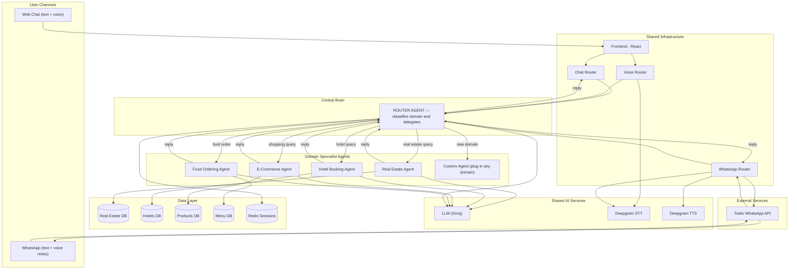
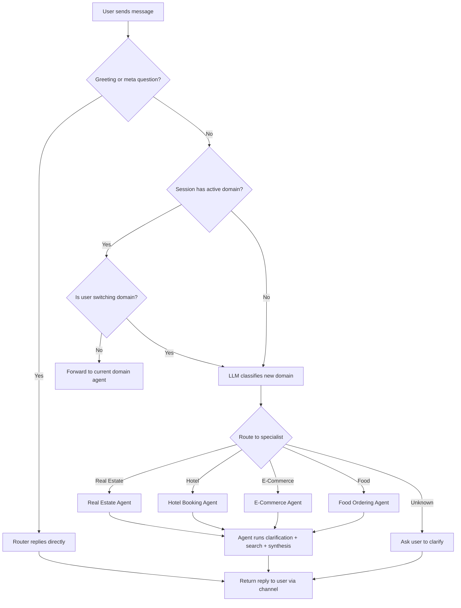

# Multi-Agent AI Platform — Proposal Document

**Prepared for:** CTO Review and Client Pitch
**Evolution of:** REALESTATE_AGENT — Single-Domain Conversational AI
**Proposal:** Extend into a Multi-Agent Platform serving multiple business verticals through one unified interface

---

## 1. Objective

Evolve the existing single-domain Real Estate AI Agent into a **multi-agent platform** where a central **Router Agent** receives all user queries, classifies the domain intent, and delegates to the appropriate **Domain Specialist Agent** — each with its own database, prompts, and business logic.

The end result: a user opens one chat (web or WhatsApp), and can seamlessly ask about real estate, book a hotel, order food, or shop for products — all in the same conversation. The platform decides which specialist handles each query, invisibly.

### Why this matters

- **One platform, many revenue streams** — each new domain is a new client vertical, not a new product build.
- **Shared infrastructure cost** — channels, voice, session management, and LLM integration are built once and reused across all agents.
- **Faster time-to-market** — adding a new domain takes 2-3 days (schema + prompts + tags), not 2-3 months.
- **Unified user experience** — customers interact with one assistant, not five separate apps.

---

## 2. How It Works

### 2.1 The Router Agent (Main Agent)

The Router Agent is a lightweight LLM-powered classifier that sits between the channel routers and the domain agents. It receives the user's message and answers one question: **"Which domain does this belong to?"**

It does NOT process the query itself. It only classifies and routes.

**Example routing decisions:**

| User message | Classified domain | Routed to |
|---|---|---|
| "I want to buy a villa in Miami" | Real Estate | Real Estate Agent |
| "Book me a hotel in Bali for next weekend" | Hotel Booking | Hotel Booking Agent |
| "Show me running shoes under $150" | E-Commerce | E-Commerce Agent |
| "Order a large pepperoni pizza" | Food Ordering | Food Ordering Agent |
| "Hi" | General greeting | Router handles directly |
| "What can you do?" | Meta question | Router handles directly |

**Classification approach (two options):**

- **Option A — LLM classification:** Send the message to the LLM with a system prompt listing available domains. The LLM returns a domain label. Cost: one extra LLM call (~0.0001 per query). Flexible; handles ambiguity well.
- **Option B — Keyword + intent classifier:** Use a lightweight local model or regex-based classifier for common patterns, falling back to LLM only for ambiguous queries. Faster; zero cost for obvious cases.

Recommended: **Option A for MVP**, migrate to Option B for high-volume production.

### 2.2 Domain Specialist Agents

Each specialist agent is a self-contained module with:

| Component | What it contains |
|---|---|
| **Database tables** | Domain-specific schema (listings, products, hotels, menu items, etc.) |
| **Clarification prompt** | Teaches the LLM which fields to extract for this domain |
| **Synthesis prompts** | Channel-aware reply generation (web, voice, WhatsApp) |
| **Tag vocabulary** | Domain-specific feature tags for filtering |
| **Query builder** | Parameterised SQL generation for this domain's schema |
| **Seed data** | Sample records for development and testing |

Everything else — channels, voice, session management, Twilio, Deepgram, Celery, Docker — is shared.

### 2.3 Session and Context Management

The session state in Redis is extended with a `current_domain` field:

```
SessionState:
  session_id: "whatsapp_923326306001"
  channel: "whatsapp"
  current_domain: "real_estate"       <-- NEW
  messages: [...]
  filter_state: {...}
  turn_count: 3
  last_results: [...]
```

This allows:
- **Domain persistence** — once the user starts talking about real estate, follow-up messages stay in that domain without re-classification.
- **Domain switching** — if the user says "actually, find me a hotel instead", the Router detects the switch, clears the filter state, and routes to the Hotel agent.
- **Cross-domain sessions** — the conversation history stays intact even when switching domains, so the user can say "go back to that villa you showed me earlier".

---

## 3. Architecture

### 3.1 System Flow Diagram



### 3.2 Routing Flow Diagram



---

## 4. What We Already Have vs What We Build

### 4.1 Reused from current system (zero changes)

| Component | Status |
|---|---|
| Web Chat channel (React + WebSocket) | Already built |
| WhatsApp channel (Twilio webhook + REST) | Already built |
| Voice input/output (Deepgram STT/TTS) | Already built |
| Session management (Redis) | Already built |
| Background jobs (Celery Worker + Beat) | Already built |
| Docker Compose infrastructure | Already built |
| LLM integration (Groq, OpenAI-compatible) | Already built |
| Twilio signature validation | Already built |

### 4.2 New components to build

| Component | Effort | Description |
|---|---|---|
| Router Agent | 1-2 days | LLM-based domain classifier + routing logic |
| Session domain tracking | 0.5 day | Add `current_domain` to SessionState, domain switch detection |
| Agent registry | 0.5 day | Config mapping domain names to agent modules |
| Per-domain agent modules | 2-3 days each | Schema + prompts + tags + query builder per new domain |
| Shared agent base class | 1 day | Extract common orchestrator logic into a reusable base |

### 4.3 Total effort estimate

| Milestone | Time |
|---|---|
| Router Agent + agent registry + session extension | 3 days |
| Refactor Real Estate Agent into the new module structure | 1 day |
| First new domain agent (e.g. Hotel Booking) | 2-3 days |
| Each additional domain agent | 2-3 days |
| **MVP (Router + Real Estate + 1 new domain)** | **~1 week** |

---

## 5. Example: Adding a Hotel Booking Agent

To add Hotel Booking as a second domain:

**Step 1 — Database:**
Create a `hotels` table (name, city, star_rating, price_per_night, amenities, room_types, images, availability).

**Step 2 — Prompts:**
Write `HOTEL_CLARIFICATION_PROMPT` to extract: city, check-in date, check-out date, guests, max price per night, star rating, amenity preferences.
Write `HOTEL_SYNTHESIS_PROMPT_CHAT`, `_VOICE`, `_WHATSAPP` for channel-aware replies.

**Step 3 — Tags:**
Define hotel amenity vocabulary: `pool`, `spa`, `gym`, `free_wifi`, `breakfast_included`, `airport_shuttle`, `beachfront`, `pet_friendly`, etc.

**Step 4 — Query builder:**
Build parameterised SQL for hotel searches with date availability checks.

**Step 5 — Register:**
Add `"hotel_booking": HotelBookingAgent` to the agent registry. The Router Agent automatically includes it in classification.

Everything else — channels, voice, WhatsApp, TTS, sessions — works automatically.

---

## 6. Business Value

### 6.1 Platform economics

| Model | Revenue structure |
|---|---|
| **SaaS per vertical** | Charge clients per domain activation ($X/month for Real Estate module, $Y/month for Hotel module) |
| **White-label** | License the entire platform to enterprises who plug in their own domains |
| **Per-conversation pricing** | Charge per successful lead/booking/order generated through the assistant |
| **Agency model** | Build and manage domain agents for clients as a service |

### 6.2 Competitive advantage

- **Speed to market** — new domain in days, not months.
- **One codebase** — engineering team maintains one platform, not N separate products.
- **Cross-domain upsell** — "I found your villa in Miami. Want me to also find hotels nearby for your guests?" — the platform can naturally cross-sell between domains.
- **Channel reach** — every new domain instantly gets Web + WhatsApp + Voice without additional integration work.

---

## 7. Key Metrics (Projected)

| Metric | Value |
|---|---|
| Channels supported | 2 (Web Chat, WhatsApp) — both with text + voice |
| Domains supported (MVP) | 2 (Real Estate + 1 new domain) |
| Domains supported (target) | 5+ |
| Time to add new domain | 2-3 days |
| Router classification accuracy | ~95%+ (LLM-based) |
| Additional infra cost per domain | ~$0 (shared infrastructure) |
| Additional LLM cost per query | ~$0.0001 (one classification call) |
| MVP build time | ~1 week from current state |

---

## 8. Risk and Mitigation

| Risk | Mitigation |
|---|---|
| Router misclassifies domain | Confidence threshold — if below 80%, ask user to clarify. Domain persistence reduces classification calls. |
| Cross-domain confusion in conversation | Clear session boundaries — switching domain resets filter state but keeps message history for context. |
| LLM latency increases with routing step | Router classification is a lightweight single-turn call (~200ms). Total latency increase is negligible. |
| Prompt complexity grows with many domains | Each domain's prompts are isolated in its own module. Router only sees domain names and descriptions, not full prompts. |

---

**Bottom line:** The multi-agent architecture transforms a single-purpose real estate chatbot into a **scalable conversational commerce platform**. The Router Agent adds one lightweight classification step while unlocking unlimited domain expansion. The infrastructure investment we have already made (channels, voice, WhatsApp, sessions, Docker) becomes the foundation for a multi-vertical product line — each new domain is configuration, not construction.
